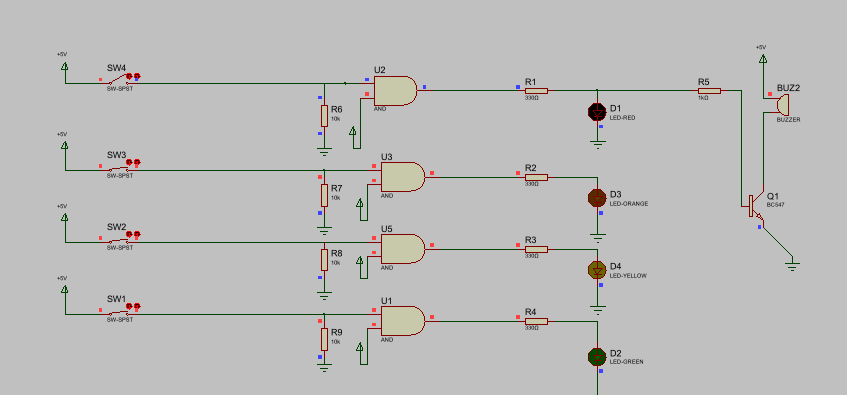

# Water Tank Overflow Alarm System

This project is a complete simulation of a water tank monitoring system, featuring both software-based UI and digital hardware logic.

## 💻 Software (Python)
- Built using the `tkinter` library.
- Provides a real-time GUI with level indicators and an alarm system.
- **How to run:** Ensure you have Python installed and run `python water-tank-project.py`.

## ⚡ Hardware Design (Proteus)
- **Logic:** Implemented using AND gates, pull-down resistors, and a BC547 transistor-based buzzer circuit.
- **Circuit Operation:**

  **Circuit OFF State:**
  *No switches are active; the system is idle, and the buzzer is silent.*
  

  **Circuit ON State:**
  *Switch 4 (Full Level) is closed, activating the top AND gate. This triggers the Red LED and completes the path for the buzzer, resulting in an audible alarm.*
  

## 🛠️ Tools Used
- **Python (tkinter):** For the GUI application.
- **Proteus:** For circuit simulation and digital logic design.
- **Git/GitHub:** For version control and project documentation.
